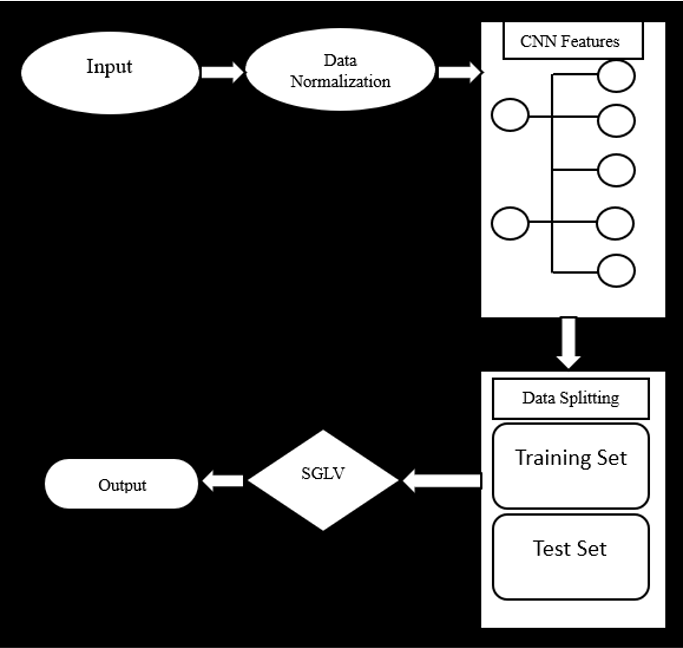

<H1 align = "center">HEART DISEASE PREDICTION</H1>
<h3 align = "center"><a href = "https://youtu.be/ca3pZG9TVOc" >DEMO VIDEO LINK</a></h3>

<b>DESCRIPTION</b>

This project utilizes logistic regression to predict heart disease based on patient attributes. It preprocesses the data, splits it into training and testing sets, trains the model, and evaluates its accuracy. Finally, it makes predictions on new data to determine the presence of heart disease.

<b>TEAM DETAILS</b>  

Team number : VH160  
<table>
  <thead>
    <tr>
      <th>Name</th>
      <th>Email</th>
    </tr>
  </thead>
  <tbody>
    <tr>
      <td>K KARAN</td>
      <td><a href="mailto:kathulakaran@gmail.com">kathulakaran@gmail.com</a></td>
    </tr>
    <tr>
      <td>P JAYANTH</td>
      <td><a href ="mailto:9921005200@klu.ac.in">9921005200@klu.ac.in</a></td>
    </tr>
    <tr>
      <td>P VENKATAKRISHNA</td>
      <td><a href ="mailto:9921005221@klu.ac.in">9921005221@klu.ac.in</a></td>
    </tr>
  </tbody>
</table>

<b>PROBLEM STATEMENT</b>  

Develop a predictive model using logistic regression to accurately classify patients into those with and without heart disease based on their medical attributes. The model should assist healthcare professionals in early detection and intervention for individuals at risk of cardiovascular ailments.

<b>ABOUT THE PROJECT</b>  

The project utilizes logistic regression to predict heart disease based on patient attributes. It preprocesses the data, trains the model, and evaluates its accuracy, enabling early detection and intervention for cardiovascular ailments. Finally, it makes predictions on new data to classify patients into those with and without heart disease.

<b>TECHNICAL IMPLEMENTATION</b>  

<b>TECH STACKS USED</b>  

google colab,ml

<b>HOW TO RUN LOCALLY</b>  

<ul>
  <li>STEP 1: Download The Dataset</li>
  <li>STEP 2: Load The Dataset in Google Colab</li>
  <li>STEP 3: Preprocess The Data Aand Build The Model</li>
  <li>STEP 4: Make The Predictions</li>
</ul>

<b>WHAT'S NEXT?</b>

<ul>
  <li>Exploring other machine learning algorithms such as random forests or support vector machines for comparison.</li>
  <li>Conducting feature engineering to enhance model performance by extracting more meaningful features from the dataset.</li>
  <li>Deploying the trained model into a real-world healthcare setting for practical use, possibly through a web or mobile application interface.</li>
</ul>

<b> DECLARATION </b> 

We confirm that the project showcased here was either developed entirely during the hackathon or underwent significant updates within the hackathon timeframe. We understand that if any plagiarism from online sources is detected, our project will be disqualified, and our participation in the hackathon will be revoked.

